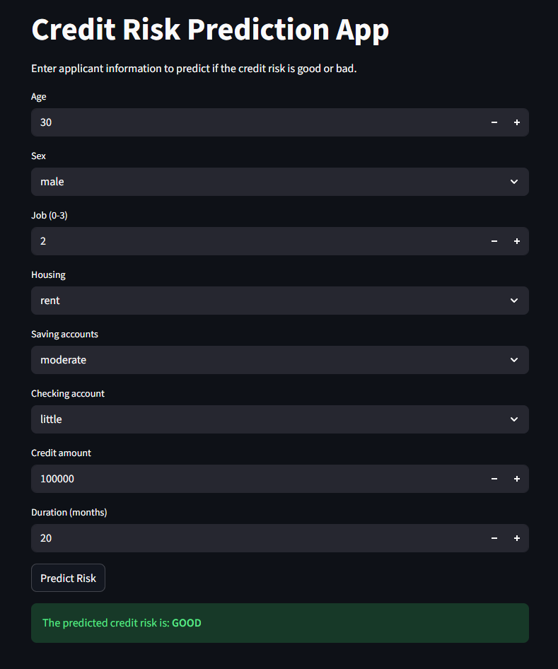

# Credit Risk Prediction

A machine learning classification project that predicts credit risk for loan applicants. The project analyzes applicant information to classify credit risk as "Good" or "Bad", helping financial institutions make informed lending decisions. An interactive Streamlit web application provides real-time risk assessment.

## Project Overview

This project uses machine learning to evaluate credit risk based on applicant demographics and financial information. After comparing multiple classification algorithms, XGBoost was selected for the final application due to its superior performance (accuracy: ~0.70).

## Web Application

The Streamlit application provides an intuitive interface for predicting credit risk based on:
- **Age**
- **Sex**
- **Job** (0-3 scale)
- **Housing** (own/rent/free)
- **Saving accounts** (little/moderate/quite rich/rich)
- **Checking account** (little/moderate/rich)
- **Credit amount**
- **Duration** (months)

### Application Interface



## Features

- **Exploratory Data Analysis (EDA)**: Comprehensive data visualization and pattern recognition
- **Multiple Classification Models**: Comparison of 4 different tree-based algorithms
- **Interactive Web App**: User-friendly interface for instant credit risk assessment
- **Model Persistence**: Saved encoders for consistent predictions

## Technologies Used

**Libraries:**
- `pandas` - Data manipulation and analysis
- `numpy` - Numerical computations
- `matplotlib` & `seaborn` - Data visualization
- `scikit-learn` - Machine learning algorithms and preprocessing
- `joblib` - Model serialization
- `streamlit` - Web application framework
- `xgboost` - Gradient boosting implementation

**Machine Learning Algorithms Tested:**
1. Decision Tree Classifier
2. Random Forest Classifier
3. Extra Trees Classifier
4. XGBoost Classifier (Selected - Accuracy: ~0.70)

## Model Development Process

### 1. Exploratory Data Analysis
- Visualized feature distributions and relationships
- Analyzed credit risk patterns across different demographics
- Handled missing values
- Identified key risk indicators

### 2. Feature Engineering
- Applied **LabelEncoder** to categorical features
- Saved encoders as .pkl files for production use
- Prepared features for classification

### 3. Machine Learning
- Trained and evaluated 4 tree-based classification algorithms
- Compared model performance using accuracy metrics
- Selected **XGBoost Classifier** as the best performer

### 4. Model Performance

| Algorithm | Accuracy |
|-----------|----------|
| XGBoost Classifier | **~0.70** |
| Random Forest Classifier | ~0.65 |
| Extra Trees Classifier | ~0.63 |
| Decision Tree Classifier | ~0.6 |

### Running the Application
```bash
streamlit run app.py
```

## Classification Output

The model classifies credit risk as:
- **GOOD** - Low risk, recommended for loan approval
- **BAD** - High risk, requires additional review

---
